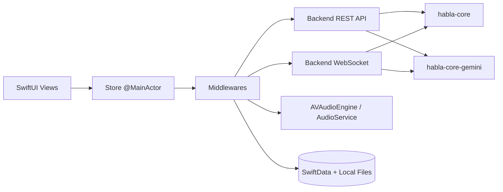
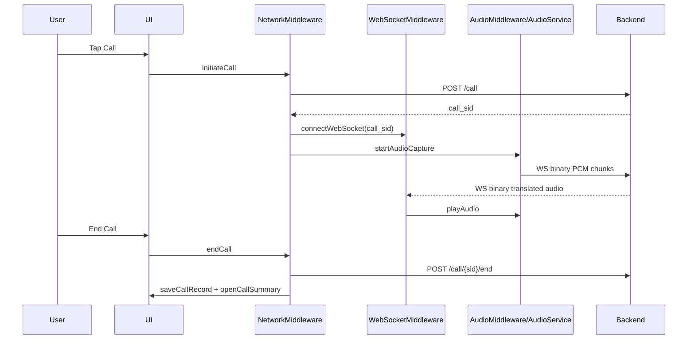

# Habla iOS Architecture

## 1. Scope

`habla-ios` is the client application for:

- Live PSTN call translation
- Agent mode call orchestration
- Caller-ID management and device-scoped ownership UX
- Local call history, summaries, and caller memory

It supports two backends selected at runtime:

- `habla-core` (Nova)
- `habla-core-gemini` (Gemini)

## 2. System Context

## 3. Client Runtime Model

The app uses a Redux-style unidirectional architecture:

- `AppState`: full UI/domain state
- `AppAction`: typed action enum for all mutations
- `appReducer`: pure synchronous reducer
- `Store`: middleware dispatch chain + reducer application

Important middleware chain (from `HablaApp`):

1. `NetworkMiddleware`
2. `WebSocketMiddleware`
3. `AudioMiddleware`
4. `CallTimerMiddleware`
5. `CallHistoryMiddleware`
6. `CallerMemoryMiddleware`
7. `AgentNetworkMiddleware`
8. `AgentWebSocketMiddleware`
9. `CallerIdMiddleware`

## 4. Live Call Mode Design

### 4.1 Control Flow

### 4.2 Audio Path

- Capture: PCM16 mono 16 kHz
- Transport: WebSocket binary frames
- Playback: PCM16 mono 16 kHz
- Audio UX state:
  - `inputAudioLevel`
  - `isReceivingAudio`
  - `liveCallPhase` (`listening/translating/speaking`)

### 4.3 Live UX Enhancements

- Pre-answer neutral tone loop starts when audio capture starts.
- Tone stops on first remote presence (`connected` status or first remote audio).
- Active call screen shows explicit phase and local/remote activity indicators.

## 5. Agent Mode Design

Agent mode does not stream local microphone audio continuously from iOS. It is control/event oriented:

- Start: `POST /agent/call`
- Events: `WS /agent/ws/{call_sid}`
- Controls from iOS:
  - `instruction`
  - `end_conversation`
  - `end_call`

Incoming event types include:

- `status`
- `agent_status`
- `transcript`
- `transcript_update`
- `critical_confirmation`
- `verified_facts_summary`

When ending, transcript entries are converted to `ConversationTurn` and persisted as a call record (`mode = .agent`).

## 6. Persistence Model

### 6.1 Call History

- Metadata: SwiftData (`CallRecordModel`)
- Conversation archive: JSON files in app support (`call-conversations/`)
- Retention policy:
  - max 200 records
  - 30-day pruning

### 6.2 Caller Memory (Local)

Stored in app support as JSON keyed by normalized phone key:

- consent flag
- preferred target language
- preferred tone
- prior issues
- call count / last call timestamp

### 6.3 Device Identity

`DeviceIdentity` is persisted (Keychain-first, fallback support), then sent in header:

- `X-Habla-Device-ID`

Used for caller-ID ownership isolation on backend side.

## 7. Caller ID Architecture

Caller ID actions are routed through backend endpoints:

- `POST /caller-id/verify/start`
- `GET /caller-id/verify/status/{phone_number}`
- `GET /caller-id/list`
- `DELETE /caller-id/{sid}`

The app stores selected caller-id SID locally; backend enforces ownership by device.

## 8. Auth and Security

When backend request auth is enabled:

- iOS sends `Authorization` header
- token format: `HMAC_SHA256(HABLA_SECRET, HABLA_APP_BUNDLE_ID)`

Per-device ownership isolation header:

- `X-Habla-Device-ID`

## 9. Failure Handling

- Middleware async tasks convert runtime errors to `AppError` actions.
- Call-end path saves local summary even when remote hangup fails.
- WebSocket disconnects fall back to local call termination flow.
- Persistence failures are intentionally non-blocking for UI responsiveness.

## 10. Design Constraints and Trade-offs

- Single `Store` simplifies reasoning and synchronization on main actor.
- Middleware-first dispatch makes side effects explicit but requires careful action ordering.
- Local persistence favors fast offline history access over centralized sync.
- Live-call latency depends strongly on backend/model response time; iOS keeps transport lightweight.
